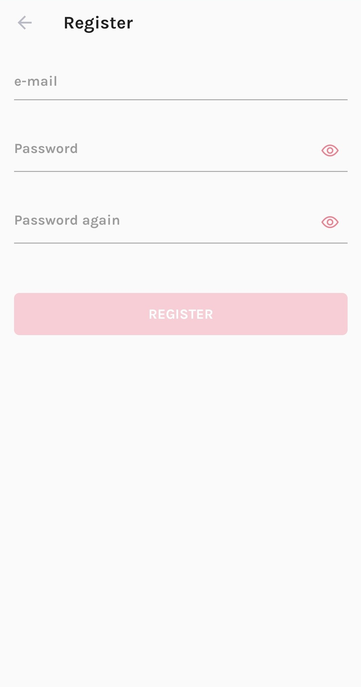

# isa-android-app-brunos252

This app was made as part of a student Android academy organised by Infinum Agency. Weekly tasks included making parts of the app design, using MVVM architecture, connecting to a database via Android Jetpack and connecting to a server. The app is a basic app for listing shows with functionalities for adding episodes and commenting on them. The app has a layout for landscape and for tablet views.

